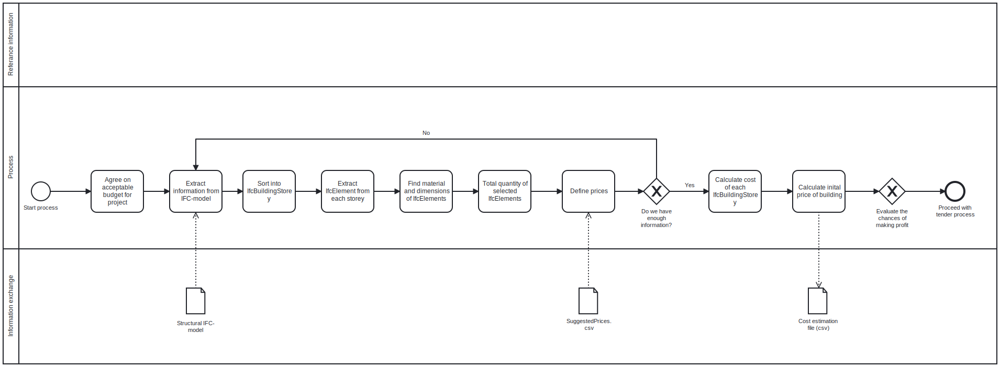
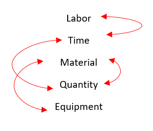

# A4: Final Project

In this file we want to present our tool and workflow, the goal of our use case and the dilemmas, decisions and changes we have made along the way. We base this file on a lot of the same questions that were presented in [A3-UseCase](https://github.com/AndersTraeland/A3-UseCase/blob/main/README.md). When working on the final script and trying to make our use case as best as possible we have had to make a few changes and assessments that differ from our original plan. In general these changes focus on optimizing and standardizing the tool in order to make it more user friendly. 

## 3A Analysing the use case

### Goal 

Our use case is Cost Estimation, and we want to calculate quantities and price of various structural IfcElements, as well as the total cost in a project. In [A3-UseCase](https://github.com/AndersTraeland/A3-UseCase/blob/main/README.md) we stated the initial goal of our workflow: 

- "To develop a script that identifies quantities and materials in order to calculate the initial cost of the structural elements in a project". 

We have, however, decided to develop this goal a little further. Our initial idea was to make a workflow that is to be used for both clients, contractors, landlords etc. In this assignment we have narrowed the target group down to contractors specifically. Our main goal is for the workflow to help contractors who specialize in the structural elements of buildings. We want them to not only estimate the prices in the early phase of the project, but also help them see where there are potential opportunities to standardize and optimize the building process. This is supposed to help them find areas where they can make profit. A full scale tender process is a tedious and costly process, and we want to help the user avoid unnecessary expenses in this stage. Our goal is therefore as follows:

- "To develop a cost estimation tool for structural elements in a building that helps contractors identify potential profit or loss before going in to a detailed and expensive tender process.

To sum it up our use case is about cost estimation in the early stages of a bidding process and how it can help contractors at this stage. 

### Model use

The uses according to the "Mapping BIM uses, use cases and processes" are still the same as we stated in [A3-UseCase](https://github.com/AndersTraeland/A3-UseCase/blob/main/README.md)  

## 3B Design for our tool and workflow

We have tried to show the process of our tool as best as possible through bpmn.io. Working with this project we have made several adjustments and changes in this bpmn, in order for it to fit our goal the best. In [A3-UseCase](https://github.com/AndersTraeland/A3-UseCase/blob/main/README.md) we have showed how we moved from one idea and developed it further. We have since realised that the new process diagram did not fully show what we want to achieve, so we have adjusted it more since. The updated version is shown below. 

### Describing the process of our tool 

 We are making a tool that will help contractors gain an overview and estimate an initial cost of a project before going into a detailed tender process. The idea is that the contractor can use as little resources and time as possible in order to decide if they want to go into bidding on a building project. When they use our worktool they will be able to see the potential, or perhaps lack of potential, in a project. Our tool focuses on the structural and bearing elements of a building: slabs, walls, beams and columns. When calculating the cost it is important to concider the effect that type of material, equipment and quantity has on the price. However, these are more or less "constant" values which is hard to drastically reduce. This is because of the overall safety and bearing requirements of any given structure. For instance the given reinforcement in a beam will in most cases already be optimized. Reducing this amount would affect the capacity of the beam. Therefore the two things that are most important when calculating cost is the time and labor that is required in order to complete the building of a structural element. How can the contractor optimize these factors by standardisation and repetition of building processes? We will come back to this later. Another factor that may help reduce the cost is the transportation. By doing this effectively and smoothly it is possible to save time and money.

 We have added a [UserGuide](https://github.com/AndersTraeland/A4-Final-Project/blob/main/UserGuide.md) for our script. The idea is that the contractor can use this to make the process as smoothly as possible.  
 
 The first thing that the contractor should do in this process is to define their goals and acceptable budgets. This will come in handy as a reference point later on. Next it is necessary to extract information from an IFC-model in order to run the script. The script then extracts elements, their material and their quantities and sorts them into different building storeys. It then provides us with the total quantity of selected elements in each story. 

 We want the user to be involved in the process and especially the end product. The unit prices are therefore input data and should be defined by the user. This is because each company have their own rates, salaries and expenses. This affects of course the price of labor. They might also have different approaches and building methods which effects the time used on a building element. The only thing that is somewhat similar for all are the cost of material and equipment. We have therefore made a list of suggested prices ([inputPrices2](https://github.com/AndersTraeland/A4-Final-Project/blob/main/Input%20data/inputPrices2.csv)) based on current market prices. The user can choose to use these prices, or edit the csv.file to their preferance. We will come back to what factors we focus on when defining the prices. In the end it is the user that decides how to price the job.

 After the prices have been defined it is time for the user to decide on whether or not they have enough information to continue the process. If they don't, they should return to the start and perhaps implement more data from ifc-files. The next step is to calculate the total cost of each building story, and then the cost for the whole building. From here it is possible to extract the results for the project as [cost](https://github.com/AndersTraeland/A4-Final-Project/blob/main/Output/cost.csv). 

 Now it's time for the user to evaluate the results. They should for instance investigate which posts that has potential for improvement and profit. Like mentioned earlier this would usually be the necessary time and labor for building elements.
- Can they do things differently in order to decrease the price?
- At this point they should also do an assessment on the potential profit of the whole project. Is it worth continuing on?
-  Should they reconsider their way of approaching the project? 

This marks the end of the initial cost estimation and the next step would be to proceed with a detailed tender process. 

 ### What affects the price? 

In the figure below we have tried to show some of the different factors that needs to be concidered when calculating the price of a building element. These are all related to each other in some type of way, and the cost may increase or decrease depending on these factors. Like we mentioned earlier it will be the time and labor factors that may vary the most from project to project. 

It is important to be aware that the cost of a material also depends on several factors:

- The market
- The region that the project is being built
- Necessary equipment in order to process and use the material
- Required machinery and transportation 

Lets take a concrete wall as an example: If you for instance need a crane in order to cast the concrete, the price will increase drastically. Each contracter must take this into concideration when deciding on the input data.  

Like we mentioned earlier we have decided that the unit prices should be input data, so that each contractor can decide and edit for themselves how they would like to price it according to their standard. We have, however, made a list of suggestions for the unit prices which can work as an indicative price. We refer to [inputPrices2](https://github.com/AndersTraeland/A4-Final-Project/blob/main/Input%20data/inputPrices2.csv) for these values. In this file the contractor can change the prices to what ever fits best. 

The price of a specific IfcElement is not always fixed. The price may increase due to difficulty and complexness of a work operation. An example of this is for instance work in elevated or tight locations. On the other hand the price may also decrease due to repetition and standardisation of a work process. If you build something in a smimilar way over and over again, you will eventually find the best and most time effective way of doing it. This will likely lead to a reduced price because the time of labor decreases. We have therefore introduced a factor that takes the change of price into consideration in our script.

We assume that for each floor above the ground the price of a building process will increase due to higher difficulty and the need for tower cranes, scaffholds etc. For instance it is much more complex and more expensive to build a slab on the 2nd floor compared to the first floor. The increase in price will be highest from the 1st to the 2nd floor, and will then increase by a smaller number for each floor. After the 10th floor the increase will be even smaller. The increasement is defined as follows:  

- 2nd floor: factor 1.2
- 2nd-10th: 1.2 + 0.05*n_floor 
- Higher than 10th floor: 1.2 + 0.05*n_floor + 0.01*(f-10)

When it comes to standardization and optimization we have introduced a learning factor, which takes the decrease in price due to repetiton of tasks into consideration. We assume that the learning factor will be reducing the price like this: 

- First three elements: 0.97^n
- Fourth element - 25th element: 0.97^3 - 0.003(n-3)
- 26th element and onwards: 0.85 

The n is the number of times an element is made. We assume that the reduction in price will be the most for the first three elements, as the learning curve will be the greatest. From there the price is assumed to decrease by a smaller number until it reaches its max reduction at 25 % after 25 elements. 

## 3C Information exchange 

The information exchange in our use case remains the same. We therefore refer to [Use_case_INFX_Team_02.xlsx](https://github.com/AndersTraeland/A3-UseCase/blob/main/Use_case_INFX_Team_02.xlsx) and point 6 in [A3-UseCase](https://github.com/AndersTraeland/A3-UseCase/blob/main/README.md)

## 3D Improvement offered by our tool 

In [A3-UseCase](https://github.com/AndersTraeland/A3-UseCase/blob/main/README.md) we talked about how we wanted our tool to offer and create value for both the user and for society.

In accordance with our developed goal and narrowed down target group, the value of the tool has also changed slightly. In the beginning we intended the tool to be of value for both contractors, clients, employers and other business partners. 

We would now like our tool to provide business value for structural contractors mainly by: 

- Reducing risk: the contractor can evaluate their chances and make a decision early on. In this way they avoid using a lot of resources and hours on a tender process that they could end up losing or make minimal profit on. 

- Increasing chances of making profit: our tool automates a process that is often done manually. This saves a lot of time and money. It also gives the user an advantage going into a tender, which can help them win more projects and refinance their business. 

In short we want to help the user reach a conclusion as soon as possible so that they dont spend unnecessary resources and time on a project. The cost estimation provides rough estimates of quantities and expenses, which the user can analyze in order to avoid negative results and suggest important improvements. 

Our cost estimation also provides value for society. We talked a little bit about this in Assignment 3, and a lot of it is still relevant. The most important is that it helps to secure profitable and successful companies which contribute to society with job offers and increased employment, more tax money and new projects to boost infrastructure, housing, industries etc. 

## 3E Delivery 

For a description on how our workflow solves the use case, we refer to point 9 of [A3-UseCase](https://github.com/AndersTraeland/A3-UseCase/blob/main/README.md). 

The description of how we make our tool has been changed a bit from the last assignment, and is covered pretty well under "Describing the process of our tool" of this README.md file. 

The most important part is this: we use IfcOpenShell to extract dimensions, materials and other relevant data from a project. This, along with an input file containing information about various prices, makes it possible to estimate a rough price for a given project. 

